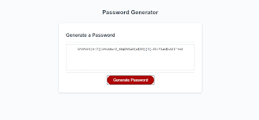

# Password-Generator
Random password generator 

## Description
My task for this week 3 assignment was to make a random password generator. It prompts the user for how they would like their password to be structured. The options include combinations of upper and lower case characters as well as special charcters and symbols. You can aslo declare how long you want your password to be. 

## Screenshot

## Website
[Live Link](https://pvon11.github.io/Password-Generator/)

